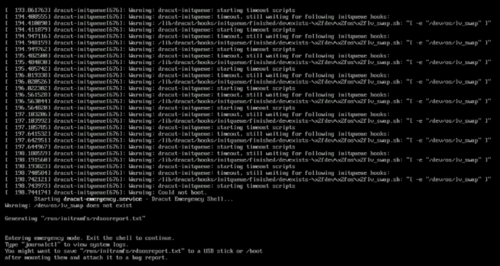

# RHEL 10.1 OS stuck during boot (/dev/os/lv_swap does not exist)

### **Issue**
The RHEL operating system is stuck during the boot process because `/dev/os/lv_swap does not exist`.


### **Troubleshooting Steps**
1. Mount LV root to /sysroot directory and change root environment
   ```bash
   mount /dev/mapper/rhel-root /sysroot
   chroot /sysroot
   ```

2. Delete the configuration or add a `#` at the beginning of the line for swap /dev/os/lv_swap in /etc/fstab.
   ```bash
   vi /etc/fstab
   -from-
   UUID=<UUID swap>        none        swap        defaults 0 0 
   -to-
   #UUID=<UUID swap>       none        swap        defaults 0 0
   ```
   


3. Mount the sysfs filesystem to the /sys directory 
   ```bash
   mount -t sysfs sysfs /sys 
   ```
4. Mount the devtmpfs filesystem to the /dev directory 
   ```bash
    mount -t devtmpfs devtmpfs /dev
   ```
5. Mount the boot partition to the /boot directory.
   ```bash 
    mount /dev/sda3 /boot

6. Change boot entry parameters in the file /boot/loader/entries/*6.12.0-124.8.1.el10_1.x86_64.conf

    Before
    ```bash
    title Red Hat Enterprise Linux (6.12.0-124.8.1.el10_1.x86_64) 10.1 (Coughlan)
    version 6.12.0-124.8.1.el10_1.x86_64
    linux /vmlinuz-6.12.0-124.8.1.el10_1.x86_64
    initrd /initramfs-6.12.0-124.8.1.el10_1.x86_64.img $tuned_initrd
    options root=/dev/mapper/rhel-root ro crashkernel=2G-64G:256M,64G-:512M {==resume=UUID=7f25641d-62ff-4960-8f4c-adb9925918df==} rd.lvm.lv=rhel/root {==rd.lvm.lv=os/lv_swap==} rd.lvm.lv=rhel/swap rhgb quiet
    grub_users $grub_users
    grub_arg --unrestricted
    grub_class rhel
    ```
    AFTER
    ```bash
    title Red Hat Enterprise Linux (6.12.0-124.8.1.el10_1.x86_64) 10.1 (Coughlan)
    version 6.12.0-124.8.1.el10_1.x86_64
    linux /vmlinuz-6.12.0-124.8.1.el10_1.x86_64
    initrd /initramfs-6.12.0-124.8.1.el10_1.x86_64.img $tuned_initrd
    options root=/dev/mapper/rhel-root ro crashkernel=2G-64G:256M,64G-:512M rd.lvm.lv=rhel/root rd.lvm.lv=rhel/swap rhgb quiet
    grub_users $grub_users
    grub_arg --unrestricted
    grub_class rhel
    ```
### Root Cause
The /etc/fstab configuration and boot entry parameters still reference the lv_swap logical volume(/dev/os/lv_swap), even though it no longer exists.


